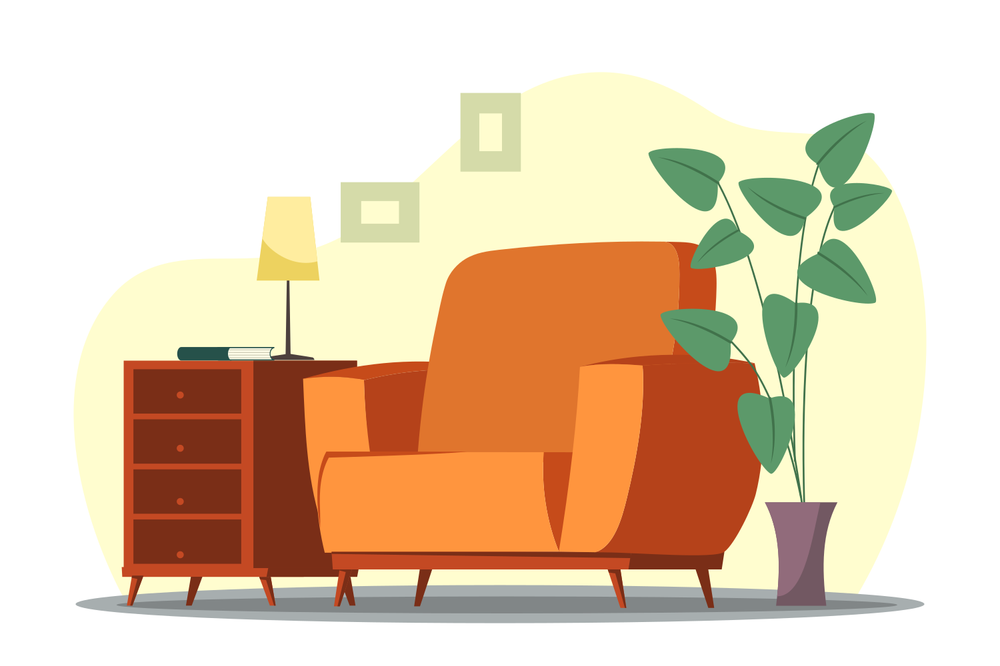

<p align="center">
    
</p>
<h1 align="center">Furnitures Simulator</h1>

> A game made with A-Frame, Vue and Vite


### [>> DEMO <<](https://vr.onivers.com/christel/)

## Included in the game

### Libs and components

- [aframe-extras](https://github.com/c-frame/aframe-extras) (MIT License)
- [aframe physx](https://github.com/c-frame/physx) (MIT License)
- [aframe-blink-controls](https://github.com/jure/aframe-blink-controls) (MIT License)
- [aframe-multi-camera](https://github.com/diarmidmackenzie/aframe-multi-camera/) (MIT License)
- [simple-navmesh-constraint](https://github.com/AdaRoseCannon/aframe-xr-boilerplate) (MIT Licence)

### Movement modes support

- **Desktop** – Keyboard for move (_WASD_ or Arrows keys) + Mouse for look control (Drag and drop)
- **Mobile** – 1x Finger touch to go forward + 2x Fingers touch to go backward + Gaze cursor for click
- **VR/AR** – walk + Teleport (Grip for grab and laser for click) + Gaze cursor for click in AR - grab objects from box with right hand + move with joystick or real deplacements

### 3D models

- **Main room with furnitures** – [Room Diorama Model](https://sketchfab.com/3d-models/room-diorama-model-5b51ae0e29824c44be9af54f9e9c2b88) by [mechamocha](https://sketchfab.com/mechamocha) is licensed under [CC Attribution](https://creativecommons.org/licenses/by/4.0/)
- **Ceiling light** - [Light Fixture - Ceiling Recessed] (https://sketchfab.com/3d-models/light-fixture-ceiling-recessed-269fd427629548a8a0949a6493c5b223) by [MozillaHubs] (https://sketchfab.com/mozillareality) is licensed under [CC Attribution] (https://creativecommons.org/licenses/by/4.0/)
- **Cardboard** - [Cardboard Box Set- Low Poly] (https://sketchfab.com/3d-models/cardboard-box-set-low-poly-5d3d508061e544739e37c685af235684) by [Nodeaxis Interactive] (https://sketchfab.com/ar.jethin) is licensed under [CC Attribution] (https://creativecommons.org/licenses/by/4.0/)

---

## Quickstart

### Create a folder for your project and move to it

### Clone (or fork, or download)

```sh
git clone https://github.com/cassissssss/FurnituresSimulator .
```

### Install dependencies

```sh
npm ci
```

### Dev

```sh
npm run dev
```

### Build

```sh
npm run build
```

## Notes for local dev on VR headset

1. Check that your development device and your VR headset are connected on **the same network**.

2. Expose you local development:

```sh
npm run dev-expose
```

3. In your VR headset, browse to the local development adress `[ip]:[port]`.

> [!NOTE]
> The certificate is self-signed, so you will probably have to confirm access to the resource in your browser.

---

## License


